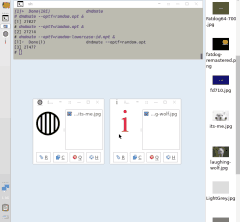
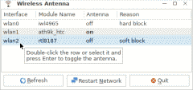
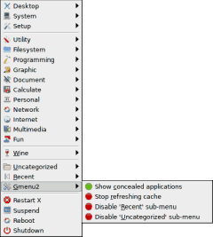
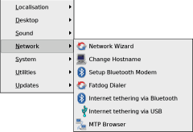
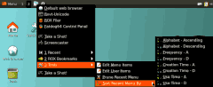
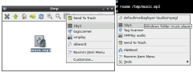
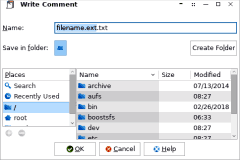
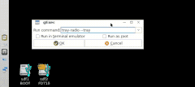

title: SCRIPTS TO GO  
date: 2019-11-08  
homepage: <https://github.com/step-/scripts-to-go>  

# Scripts To Go

_Are you sated?_

## DOWNLOADS

Since November 2019 each script, and accompanying files and documentation, is
packaged as a tar archive, which includes an installer and uninstaller, and can
be downloaded from the [:release](#LINKS) page.
Scripts are occasionally updated, and new, individual packages released.

The release page lists package versions. This page does not.

## INTRO

This is a collection of scripts that I developed and maintain mostly for my
personal use on Fatdog64 Linux.[:1](#LINKS).
Originated from Puppy Linux[:2](#LINKS), nowadays Fatdog64 is built from Linux
From Scratch (LFS)[:3](#LINKS) but still retains good compatibility with Puppy.

Most scripts in this collection are licensed under the terms of the GNU GPL
version 2 license --- with a few exceptions, noted in the specific scripts,
being licensed under the MIT license.

The scripts assume that the GNU flavor of various shell commands is installed,
and that GTK2+ is the GUI toolkit. Also, some scripts use [:4](#LINKS) for GUI
dialogs --- in particular version 0.42 because it's the last version that
supports GTK2.

Most scripts run in the POSIX-compliant dash[:5](#LINKS) shell but are marked
with the more generally available Bourne shell she-bang `#!/bin/sh` to simplify
installation across Linux variants.  Scripts that require features of a specific
shell set the she-bang to reflect that shell, e.g., `#!/bin/bash`.

## SCRIPTS

* [dndmate](#dndmate) (automation)
* [fatdog-wireless-antenna](#fatdog-wireless-antenna) (network)
* [gmenu2](#gmenu2) (system menu)
* [gmenu2-fdcp](#gmenu2-fdcp) (control panel)
* [quicklaunch](#quicklaunch) (personal menu)
* [roxmm](#roxmm) (file menu)
* [s-write-comment](#s-write-comment) (file)
* [tray-radio](#tray-radio) (audio)

----

## dndmate

Drag-and-drop list maker and automator

 .

[README](dndmate/README.md)

Screenshot:
version 1.4.0

----

## fatdog-wireless-antenna

WiFi Antenna Manager for Fatdog64

 .

[README](fatdog-wireless-antenna/README.md)

Screenshot:
version 1.0.0. In version 1.1.0 column "Details" replaces column "Reason".

----

## gmenu2

Stand-alone extended application menu

 (gtkmenuplus[:6](#LINKS) icon)

[README](gmenu2/README.md)

Screenshot:
gmenu2 showing the traditional Fatdog64 application categories,
as well as its own submenus 'Wine', 'Uncategorized', 'Recent', and 'Gmenu2'.
If [gmenu2-fdcp](#gmenu2-fdcp) is installed, a 'Control Panel' submenu will
be shown, too.
The 'Recent' submenu tracks command activations for quick re-use.
Recent items are shared with [quicklaunch](#quicklaunch).

----

## gmenu2-fdcp

Stand-alone Fatdog64 control menu (also [gmenu2](#gmenu2) extension)

 .

[README](gmenu2-fdcp/README.md)

Screenshot:
gmenu2-fdcp control menu displaying the default large font and 32-pixel icons
(resizable) on Fatdog64 700.

----

## quicklaunch

Quick-launch user menu

 (gtkmenuplus[:6](#LINKS) icon)

[README](quicklaunch/README.md)

Screenshot:
LXQt Panel (top) --- the four default panel icons (Browser,
Terminal, Rox and Control panel) have migrated to the top of Quicklaunch menu
so the Panel has more space for application icons.
Here the Quicklaunch menu is displaying two user-added items
(Take-a-shot and Screencaster), and three submenus
(Recently-executed commands, Rox bookmarks and Tools).

Themes: Fatdog64-802 default LXQt Panel theme (ambiance) with the
Quicklaunch-ambiance menu theme.

----

## roxmm

ROX-Filer SendTo menu emulator

 (gtkmenuplus[:6](#LINKS) icon)

[README](roxmm/README.md)

Right - actual rox SendTo menu.
Left - roxmm emulated menu. Note the tooltip and the Tools menu.

----

## s-write-comment

File comment file writer

 .

[README](s-write-comment/README.md)

Screenshot:
version 1.0.0.

----

## tray-radio

Internet radio and media file tray icon menu

 .

[README](tray-radio/README.md)

Screenshot:

----

<a name="LINKS">

## LINKS

**Homepage**
[github.com/step-/scripts-to-go](https://github.com/step-/scripts-to-go)

**Release packages**
[github.com/step-/scripts-to-go/releases](https://github.com/step-/scripts-to-go/releases)

**:1** Fatdog64 Linux
[distro.ibiblio.org/fatdog/web/](http://distro.ibiblio.org/fatdog/web/)

**:2** Puppy Linux
[puppylinux.com/](http://puppylinux.com/)

**:3** Linux From Scratch
[www.linuxfromscratch.org](https://www.linuxfromscratch.org)

**:4** yad GUI dialog
[github.com/v1cont/yad)[yad](https://github.com/v1cont/yad)

**:5** dash shell
[www.mankier.com/1/dash](https://www.mankier.com/1/dash)

**:6** gtkmenuplus
[github.com/step-/gtkmenuplus](https://github.com/step-/gtkmenuplus)

**:x** busybox
[busybox.net/about.html](https://busybox.net/about.html)
