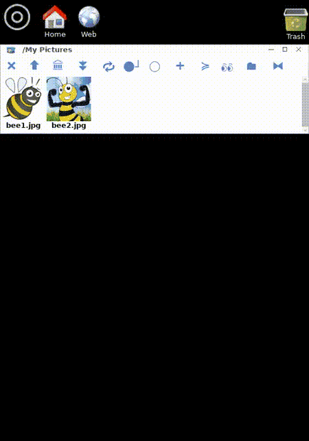
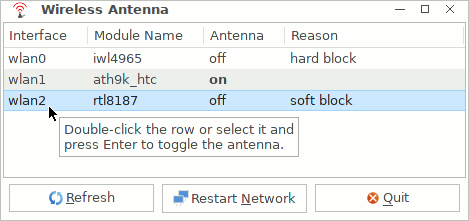
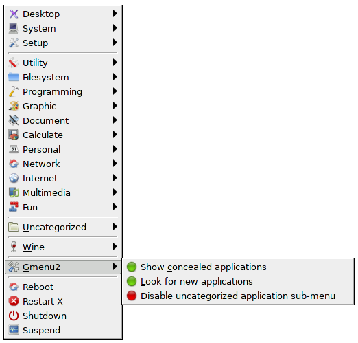
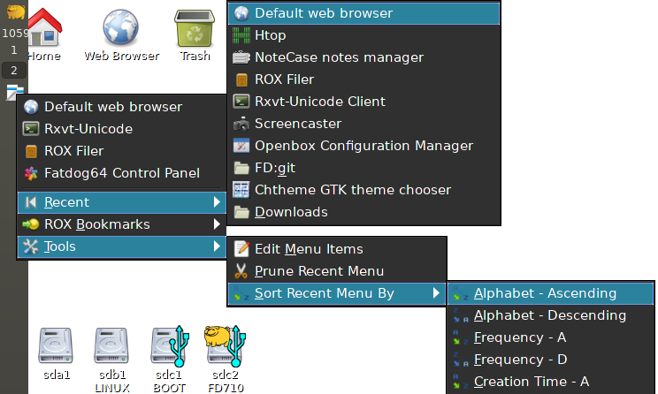
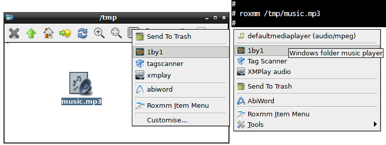
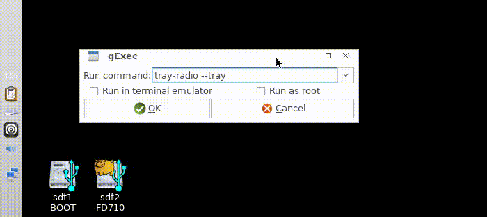

# Scripts To Go

_Are you sated?_

I develop my scripts mostly for
[Fatdog64 Linux](http://distro.ibiblio.org/fatdog/web/).[1]
Fatdog64-7xx is built from _Linux From Scratch (LFS)_, and maintains
excellent compatibility with [Puppy Linux](http://puppylinux.com/).

These scripts assume that the GNU versions of various shell commands are
installed, and that GTK2+ is the GUI toolkit.

Unless otherwise noted, the Software in this repository is licensed
under the terms of the GNU GPL version 2 (GPLv2) license.

These scripts are written to be compatible with the POSIX-compliant _ash_
shell, a [busybox](https://busybox.net/about.html) applet. The she-bang line is
generically set as `#!/bin/sh` to simplify packaging across Linux variants. For
scripts that require features of a specific shell, the she-bang is set to
reflect the required shell, i.e. `#!/bin/bash`.

Scripts in this page:

* [dndmate](./README.md#dndmate)
* [fatdog-wireless-antenna](./README.md#fatdog-wireless-antenna)
* [gmenu2](./README.md#gmenu2)
* [gmenu2-fdcp](./README.md#gmenu2-fdcp)
* [quicklaunch](./README.md#quicklaunch)
* [roxmm](./README.md#roxmm)
* [s-write-comment](./README.md#s-write-comment)
* [tray-radio](./README.md#tray-radio)

----

<a href="dndmate"></a>
## dndmate

Drag-and-drop Collector and Automator

**Usage Scenarios**

* You have multiple filer windows open in different folders, and you want to
  perform an action (run a command) targeting some of the files in some of the
  open filer windows.
* You keep an ongoing list of file paths, and you want to add files to the list
  with a mouse action from a filer window, and also with a simple shell command.
* Some of the above scenarios, targeting web links in addition to files, i.e.,
  keeping a list of web bookmarks.

**Installing**

* Download and unpack the repository snapshot
  [tar file](https://github.com/step-/scripts-to-go/archive/master.tar.gz).
* Download and unpack the required repository snapshot
  [yad-lib tar file](https://github.com/step-/yad-lib/archive/master.tar.gz).
    cp usr/bin/yad-lib.sh /usr/bin/yad-lib.sh
* Run `install/install-dndmate.sh` from the unpacked folder.
  `--help` is a command-line option.
* Optionally, if ROX-Filer is your file manager, drag-and-drop the ROX-App
  `/usr/local/apps/dndmate` to your desktop, or create a link to it on your
  desktop.
* Run `dndmate` in a terminal window to start the drag-and-drop target.

**Dependencies**

An updated list of dependencies is included in the comment block at
the top of the
[script file](https://github.com/step-/scripts-to-go/blob/master/usr/bin/dndmate).

Ensure the vesion of yad in your system meets the minimum requirement listed
below. Note in particular that you might need to compile a git commit from the
yad author's [repository](https://github.com/v1cont/yad) to meet the minimum
requirement marked in bold font below.

Roughly these include:
* Required shell libraries: yad-lib >= 1.0.0
* Required packages: yad >= 0.40.3 **git b3a99043**, gawk >= 4.1.1, findutils >= 4.4.2, bash >= 4.3
* Suggested packages: netpbm-advanced >= 10.64
* [yad-lib](https://github.com/step-/yad-lib), see section _Installing_.

**Help** - Hover over the buttons for tooltip help. Press the Help button for
full help text.

**Tips**

* The look of dndmate targets can be styled to a great extent. Read all about
  it in the style file `/usr/share/dndmate/stylef`.
* To work on different lists at once, run separate instances with `--id`, i.e.

```
dndmate --id=music & dndmate --id=weblinks &
```

* Add your frequently-used commands to the command history file: Click \[R\]
  in the main window, then \[Edit\].
* Read the Help file! Click \[H\] in the main window.

**See also** [YAD Tips thread](http://murga-linux.com/puppy/viewtopic.php?p=908353#908353)

**Thanks** - stemsee, MochiMoppel.



----

<a href="fatdog-wireless-antenna"></a>
## fatdog-wireless-antenna

WiFi Antenna Manager for Fatdog64

**Target User**

* Fatdog64 users with multiple wireless interfaces.
* Other (Puppy) Linux users - minimum shell source code adaptions needed, see
  _Porting to Other Linux_.

**Features**

* Enable/disable antenna.
* Auto-detect wireless interface changes: enabled, connected to access point (AP), IP address.
* Restart Fatdog64 networking.

**Installing**

* Download and unpack the repository snapshot
  [tar file](https://github.com/step-/scripts-to-go/archive/master.tar.gz).
* Run `install/install-fatdog-wireless-antenna.sh` from the unpacked folder.
* Download and unpack the required repository snapshot
  [shnetlib tar file](https://github.com/step-/shnetlib/archive/master.tar.gz).
    cp usr/sbin/shnetlib.sh /usr/sbin/shnetlib.sh
* Download and unpack the required repository snapshot
  [yad-lib tar file](https://github.com/step-/yad-lib/archive/master.tar.gz).
    cp usr/bin/yad-lib.sh /usr/bin/yad-lib.sh
* Run `fatdog-wireless-antenna.sh &` in a terminal window to start the main
  window.

**Dependencies**

* [shnetlib](https://github.com/step-/shnetlib)
* [yad-lib](https://github.com/step-/yad-lib)
* yad (tested since version 0.36.3)
* rfkill (tested with busybox 1.27.0.git rfkill).

**Help** - Hover over list items for tooltip help.

**Porting to Other Linux**

See file [PORTING](fatdog-wireless-antenna/usr/share/doc/fatdog-wireless-antenna/PORTING.md).

**Screenshot**



Screenshot of version 1.0.0. In version 1.1.0 column "Details" replaces column "Reason".

----

<a href="gmenu2"></a>
## gmenu2

Fatdog64 System and Application Menu

**Usage Scenarios**

* Replacing the out-of-the-box Fatdog64 System menu because you don't
  use the Openbox and JWM window managers.
* Displaying the system menu with a global hotkey.

**Installing**

* Download and unpack the repository snapshot
  [tar file](https://github.com/step-/scripts-to-go/archive/master.tar.gz).
* Run `install/install-gmenu2.sh` from the unpacked folder.
  `--help` is a command-line option.
* Optionally set a global hotkey to activate the menu.
  For the _Sven_ keyboard manager: open the Preferences dialog, select
  **Keyboard**, **New** **Description** _System Menu_ **Key code**
  _Win+s_ **Runs** Program _gmenu2_.
* See also script _gmenu2-fdcp_ in this repository.
* Run `gmenu2` from a terminal window to display the menu.

**Extensions**

If gmenu2 finds script `gmenu2-fdcp` somewhere in the `PATH` it
automatically adds menu entries for all Fatdog64 control panel items.

**Dependencies** - [gtkmenuplus](https://github.com/step-/gtkmenuplus).

**Help** - Hover over menu entries for tooltip help.

**Thanks** - Gmenu2 was inspired by SFR's GMenu script.

**Screenshot**

Note the typical Puppy Linux system sub-menus, and the additional
'Wine', 'Uncategorized', 'Recent', and 'Gmenu2' sub-menus.  'Recent'
automatically tracks item and launcher activations for quick re-use.
Recent items are shared with _quicklaunch_, another menu script in this
repository.



----

<a href="gmenu2-fdcp"></a>
## gmenu2-fdcp

Fatdog64 Control Panel As a Menu

**Usage Scenarios**

* Quickly viewing and running the many system functions that the
  Fatdog64 Control Panel provides.
* Displaying a Control Panel menu with a global hotkey.

**Installing**

* Download and unpack the repository snapshot [tar file](https://github.com/step-/scripts-to-go/archive/master.tar.gz).
* Run `install/install-gmenu1-fdcp.sh` from the unpacked folder.
  `--help` is a command-line option.
* Optionally set a global hotkey to activate the menu.
  For the _Sven_ keyboard manager: open the Preferences dialog, select
  **Keyboard**, **New** **Description** _Control Panel Menu_ **Key code**
  _Win+p_ **Runs** Program _gmenu1-fdcp_.
* This script works stand-alone and also as an embeddable module in
  another gtkmenuplus menu. See script _gmenu1_ in this repository.
* For stand-alone use, run `gmenu2-fdcp` from a terminal window.

**Dependencies** - [gtkmenuplus](https://github.com/step-/gtkmenuplus).

**Help** - `gmenu2-fdcp --help`

**Screenshot**

Fatdog64 control menu with default large font and 32-pixel icons.
Smaller font and icons can be set by editing the script.


----

<a href="quicklaunch"></a>
## quicklaunch

Customizable Desktop Panel and User Menu

**Usage Scenarios**

* Condensing Fatdog64 Desktop Panel icons into a single icon to free
  some Panel real estate.
* Displaying a quick-launch menu with a global hotkey.
* Automatically tracking your command usage for quick re-use.
* Keeping all customized commands in a single text file.

**Installing**

* Download and unpack the repository snapshot [tar file](https://github.com/step-/scripts-to-go/archive/master.tar.gz).
* Run `install/install-quicklaunch.sh` from the unpacked folder.
  `--help` is a command-line option.
* Optionally set a global hotkey to activate the menu.
  For the _Sven_ keyboard manager: open the Preferences dialog, select
  **Keyboard**, **New** **Description** _Quicklaunch Menu_ **Key code**
  _Win+x_ **Runs** Program _/root/quicklaunch.gtkmenuplus_.

Optionally, replace multiple Desktop Panel icons with a single icon that
starts the quicklauch menu. Instructions for LXQt Panel users:
Edit file _~/.config/lxqt/panel.conf_.  If you don't have this
file, copy the system default file _/etc/xdg/lxqt/panel.conf_ to
_~/.config/lxqt/panel.conf_ then edit the latter.  Look for section
`[quicklaunch]`. By default in Fatdog64-710 it looks like this:

```
[quicklaunch]
type=quicklaunch
apps/size=4
apps\1\desktop=/usr/share/applications/default-browser.desktop
apps\2\desktop=/usr/share/applications/urxvt.desktop
apps\3\desktop=/usr/share/applications/rox.desktop
apps\4\desktop=/usr/share/applications/fatdog-control-panel.desktop
```

It may look differently on your system if you have customized your LXQt
panel.  Change the above to:

```
[quicklaunch]
type=quicklaunch
apps\size=1
apps\1\desktop=/root/.local/share/applications/quicklaunch.desktop
```

Then restart X for the changes to take effect. Now your LXQt panel
should include just one icon, and when you click it a menu for the four
default icons that your replaced should be displayed.  Should you want
different menu items edit file _~/quicklaunch.gtkmenuplus_.

If you did add the quicklaunch icon to the Desktop Panel, you may also
want for the menu colors to match the Desktop Panel theme. How to do so
is explained in _~/.local/usr/share/applications/quicklaunch.desktop_,
which sets the Onyx theme by default. If your desktop uses a different
theme edit _quicklaunch.desktop_.  Instructions are given in the file.

**Dependencies** - [gtkmenuplus](https://github.com/step-/gtkmenuplus).

**Help** - Read section `---- Help ----` of file _~/quicklaunch.desktop_.

**Screenshot**

The Quicklaunch Menu icon is installed in LXQt Panel, the vertical bar
on the left side), and replaces the default set of application icons;
Default Web Browser, Rxvt-Unicode, ROX Filer and Fatdog64 Control
Panel. The Panel bar is unincumbered while the default applications
can still be accessed as menu items. Moreover, there is a sub-menu of
ROX Filer bookmarks, and an automatically-updated sub-menu of "Recent"
command invocations. Those are the commands that the user invokes
frequently through Quicklaunch.  In this picture, Quicklaunch sports the
Onyx theme.



----

<a href="roxmm"></a>
## roxmm

ROX-Filer SendTo Menu Look-Alike

**Installing**

* Download and unpack the repository snapshot [tar file](https://github.com/step-/scripts-to-go/archive/master.tar.gz).
* Run `install/install-roxmm.sh` from the unpacked folder.
  `--help` is a command-line option.

**Dependencies** - [gtkmenuplus](https://github.com/step-/gtkmenuplus).

**Help** - `roxmm --help`

**Screenshot**

Right - rox SendTo menu. Left - corresponding roxmm menu. Note tooltip
and Tools menu.



----

<a href="s-write-comment"></a>
## s-write-comment

File comment writer for Fatdog64 ROX-Filer build

**Target User**

* Fatdog64 72x+ users. This script works best in conjuction with the Fatdog64
  ROX-Filer build.
* Users of version of Puppy Linux that feature the "comments" patch for
  ROX-Filer.
* Anyone who wants to keep a comment file alongside another file, i.e.
  `filename.ext.txt` holding comments about `filename.ext`.

**Features**

* Right-click ROX-Filer action "Add Comment File".
* Command-line options to customize actions and manage comment files.

**Installing**

* Download and unpack the repository snapshot
  [tar file](https://github.com/step-/scripts-to-go/archive/master.tar.gz).
* Copy the files rooted in `s-write-comments` to equivalent positions under
  `/`.
* Reboot to enable the ROX-Filer right-click action.

**Help** - In a terminal window run `s-write-comment.sh --help`.

**Screenshot**


Screenshot of version 1.0.0.

----

<a href="tray-radio"></a>
## tray-radio

Internet Radio (and Media File) Tray Icon Menu

**Target User**

* You want to select Internet radio stations, and other media files, from a
  menu that uses your existing `.m3u` playlists and URL list files.
* You don't need a flashy graphical window; you want a light-weight, quick,
  simple-to-configure solution.
* You like to configure your media lists using text files and nothing more.

**Installing**

* Download and unpack the repository snapshot [tar file](https://github.com/step-/scripts-to-go/archive/master.tar.gz).
* Run `install/install-tray-radio.sh` from the unpacked folder.
  `--help` is a command-line option.
* Run `tray-radio --tray &` in a terminal window to start the tray icon.

**Dependencies**

* [gtkmenuplus](https://github.com/step-/gtkmenuplus).

* Run `tray-radio --help=all` to list other script dependencies, which are shown
  near the end of the output text.

* Optionally install the _mpg123_ command-line MP3 player (recommended). For Fatdog64,
  [mpg123](http://distro.ibiblio.org/fatdog/contrib/packages/710/mpg123-1.23.8-x86_64-1.txz)
  can be installed using the gslapt package manager.

**Help** - `tray-radio --help`, `tray-radio --help=all`, `tray-radio --help=all-gui`

**FAQ**

1. Can tray-radio use my preferred media player 'xyz'?

Yes. It can even use different media players in the same menu. See help topic
_DEFAULT PLAY COMMAND_.

2. Can I format menu items with color, different fonts, etc. ?

Yes. You can apply all
[gtkmenuplus](https://github.com/step-/gtkmenuplus) formatting
[directives](https://github.com/step-/gtkmenuplus/blob/master/docs/menu_configuration_file_format.txt).
See help topic _GTKMENUPLUS-ENTRY_.

3. Can I add icons to the menu?

Yes. Use `#menu icon=`. An example is shown when you run `tray-radio --help=all`.

4. Does tray-radio support theming?

Yes. It supports GTK2 menu themes, so you can change the way the menu looks,
and the icon set associated with the theme. See help topic _THEMING_.

**Screenshot**



----
