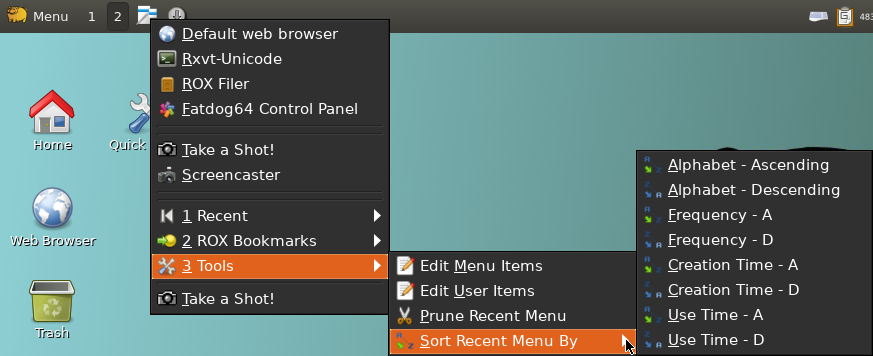

title: SCRIPTS TO GO  
date: 2019-10-05  TODO  
homepage: <https://github.com/step-/scripts-to-go>  

# Scripts To Go

_Are you sated?_

## INTRO

This is a collection of scripts that I have developed and maintain for my
personal use on Fatdog64 Linux.[:1](#LINKS).
Originated from Puppy Linux[:2](#LINKS), nowadays Fatdog64 is built from Linux
From Scratch (LFS)[:3](#LINKS) but still retains good compatibility with Puppy.

Most scripts in this collection are licensed under the terms of the GNU GPL
version 2 license --- with a few exceptions, noted in the specific scripts,
being licensed under the MIT license.

The scripts assume that the GNU flavor of various shell commands is installed,
and that GTK2+ is the GUI toolkit. Also, some scripts use [:4](#LINKS) for GUI
dialogs --- in particular version 0.42 because it's the last version that
supports GTK2.

Most scripts run in the POSIX-compliant dash[:5](#LINKS) shell but are marked
with the more generally available Bourne shell she-bang `#!/bin/sh` to simplify
installation across Linux variants.  Scripts that require features of a specific
shell set the she-bang to reflect that shell, e.g., `#!/bin/bash`.

Since late 2019 each script, and accompanying files and documentation, is
packaged as a tar archive, which includes an installer and uninstaller, and can
be downloaded from the [:release](#LINKS) page.
Scripts are occasionally updated, and a new, individual package released.

## SCRIPTS

* [dndmate](#dndmate)
* [fatdog-wireless-antenna](#fatdog-wireless-antenna)
* [gmenu2](#gmenu2)
* [gmenu2-fdcp](#gmenu2-fdcp)
* [quicklaunch](#quicklaunch)
* [roxmm](#roxmm)
* [s-write-comment](#s-write-comment)
* [tray-radio](#tray-radio)

----

<a href="dndmate"></a>
## dndmate

Drag-and-drop Collector and Automator

**Usage Scenarios**

* You have multiple filer windows open in different folders, and you want to
  perform an action (run a command) targeting some of the files in some of the
  open filer windows.
* You keep an ongoing list of file paths, and you want to add files to the list
  with a mouse action from a filer window, and also with a simple shell command.
* Some of the above scenarios, targeting web links in addition to files, i.e.,
  keeping a list of web bookmarks.

**Installing**

* Download and unpack the repository snapshot
  [tar file](https://github.com/step-/scripts-to-go/archive/master.tar.gz).
* Download and unpack the required repository snapshot
  [yad-lib tar file](https://github.com/step-/yad-lib/archive/master.tar.gz).
    cp usr/bin/yad-lib.sh /usr/bin/yad-lib.sh
* Run `install/install-dndmate.sh` from the unpacked folder.
  `--help` is a command-line option.
* Optionally, if ROX-Filer is your file manager, drag-and-drop the ROX-App
  `/usr/local/apps/dndmate` to your desktop, or create a link to it on your
  desktop.
* Run `dndmate` in a terminal window to start the drag-and-drop target.

**Dependencies**

An updated list of dependencies is included in the comment block at
the top of the
[script file](https://github.com/step-/scripts-to-go/blob/master/usr/bin/dndmate).

Ensure the vesion of yad in your system meets the minimum requirement listed
below. Note in particular that you might need to compile a git commit from the
yad author's [repository](https://github.com/v1cont/yad) to meet the minimum
requirement marked in bold font below.

Roughly these include:
* Required shell libraries: yad-lib >= 1.0.0
* Required packages: yad >= 0.40.3 **git b3a99043**, gawk >= 4.1.1, findutils >= 4.4.2, bash >= 4.3
* Suggested packages: netpbm-advanced >= 10.64
* [yad-lib](https://github.com/step-/yad-lib), see section _Installing_.

**Help** - Hover over the buttons for tooltip help. Press the Help button for
full help text.

**Tips**

* The look of dndmate targets can be styled to a great extent. Read all about
  it in the style file `/usr/share/dndmate/stylef`.
* To work on different lists at once, run separate instances with `--id`, i.e.

```
dndmate --id=music & dndmate --id=weblinks &
```

* Add your frequently-used commands to the command history file: Click \[R\]
  in the main window, then \[Edit\].
* Read the Help file! Click \[H\] in the main window.

**See also** [YAD Tips thread](http://murga-linux.com/puppy/viewtopic.php?p=908353#908353)

**Thanks** - stemsee, MochiMoppel.


----

<a href="fatdog-wireless-antenna"></a>

## fatdog-wireless-antenna

WiFi Antenna Manager for Fatdog64

 .

[README](fatdog-wireless-antenna/README.md)

Screenshot:
version 1.0.0. In version 1.1.0 column "Details" replaces column "Reason".


----

<a href="gmenu2"></a>

## gmenu2

Stand-alone extended application menu

 (reused gtkmenuplus[:6](#LINKS) icon)

[README](gmenu2/README.md)

Screenshot:
gmenu2 showing the traditional Fatdog64 application categories,
as well as its own submenus 'Wine', 'Uncategorized', 'Recent', and 'Gmenu2'.
If [gmenu2-fdcp](#gmenu2-fdcp) is installed, a 'Control Panel' submenu will
be shown, too.
The 'Recent' submenu tracks command activations for quick re-use.
Recent items are shared with [quicklaunch](#quicklaunch).


----

<a href="gmenu2-fdcp"></a>

## gmenu2-fdcp

Stand-alone Fatdog64 control menu (also [gmenu2](#gmenu2) extension)

 .

[README](gmenu2-fdcp/README.md)

Screenshot:
Gmenu2-fdcp control menu displaying the default large font and 32-pixel icons
(resizable) on Fatdog64 700.


----

<a href="quicklaunch"></a>

## quicklaunch

Quick-launch user menu

 (reused gtkmenuplus[:6](#LINKS) icon)

[README](quicklaunch/README.md)

Screenshot: LXQt Panel (top) --- the four default panel icons (Browser,
Terminal, Rox and Control panel) have migrated to the top of Quicklaunch menu
so the Panel has more space for application icons.
Here the Quicklaunch menu is displaying two user-added items
(Take-a-shot and Screencaster), and three submenus
(Recently-executed commands, Rox bookmarks and Tools).

Themes: Fatdog64-802 default LXQt Panel theme (ambiance) with the
Quicklaunch-ambiance menu theme.



----

<a href="roxmm"></a>

## roxmm

ROX-Filer SendTo menu emulator

 (reused gtkmenuplus[:6](#LINKS) icon)

[README](roxmm/README.md)

Right - actual rox SendTo menu.
Left - roxmm emulated menu. Note the tooltip and the Tools menu.


----

<a href="s-write-comment"></a>
## s-write-comment

File comment writer for Fatdog64 ROX-Filer build

**Target User**

* Fatdog64 72x+ users. This script works best in conjuction with the Fatdog64
  ROX-Filer build.
* Users of version of Puppy Linux that feature the "comments" patch for
  ROX-Filer.
* Anyone who wants to keep a comment file alongside another file, i.e.
  `filename.ext.txt` holding comments about `filename.ext`.

**Features**

* Right-click ROX-Filer action "Add Comment File".
* Command-line options to customize actions and manage comment files.

**Installing**

* Download and unpack the repository snapshot
  [tar file](https://github.com/step-/scripts-to-go/archive/master.tar.gz).
* Copy the files rooted in `s-write-comments` to equivalent positions under
  `/`.
* Reboot to enable the ROX-Filer right-click action.

**Help** - In a terminal window run `s-write-comment.sh --help`.

**Screenshot**


Screenshot of version 1.0.0.

----

<a href="tray-radio"></a>

## tray-radio

Internet radio and media file tray icon menu

 .

[README](tray-radio/README.md)


----

<a name="LINKS">

## LINKS

**Homepage**
[github.com/step-/scripts-to-go](https://github.com/step-/scripts-to-go)

**Release packages**
[github.com/step-/scripts-to-go/releases](https://github.com/step-/scripts-to-go/releases)

**:1** Fatdog64 Linux
[distro.ibiblio.org/fatdog/web/](http://distro.ibiblio.org/fatdog/web/)

**:2** Puppy Linux
[puppylinux.com/](http://puppylinux.com/)

**:3** Linux From Scratch
[www.linuxfromscratch.org](https://www.linuxfromscratch.org)

**:4** yad GUI dialog
[github.com/v1cont/yad)[yad](https://github.com/v1cont/yad)

**:5** dash shell
[www.mankier.com/1/dash](https://www.mankier.com/1/dash)

**:6** gtkmenuplus
[github.com/step-/gtkmenuplus](https://github.com/step-/gtkmenuplus)

**:x** busybox
[busybox.net/about.html](https://busybox.net/about.html)
